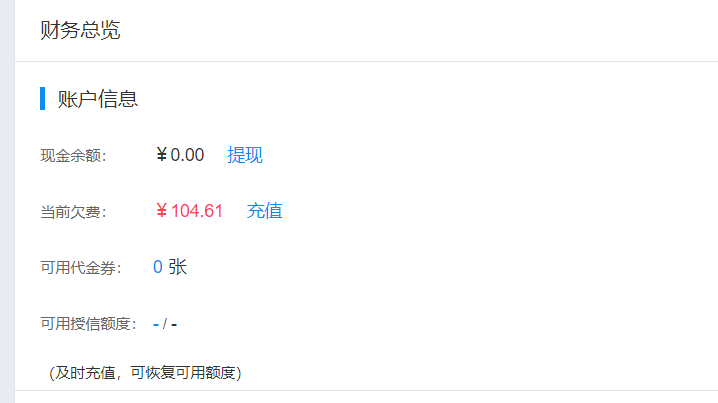
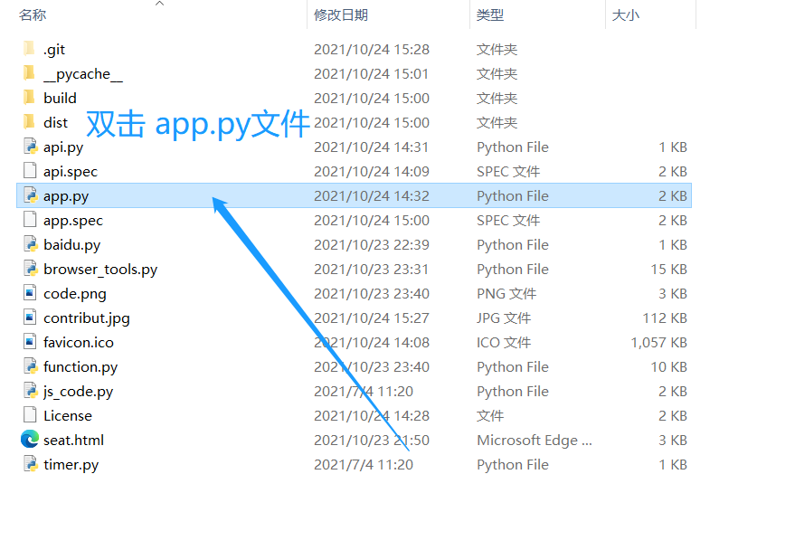
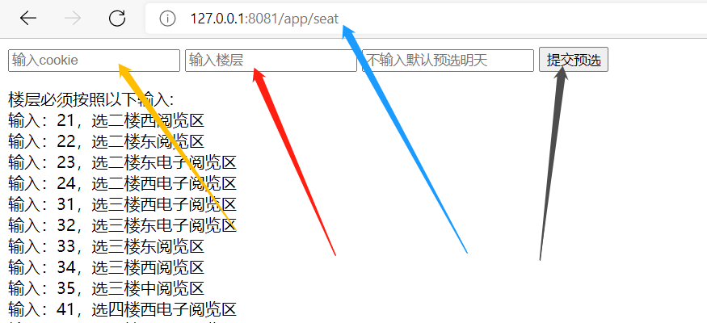
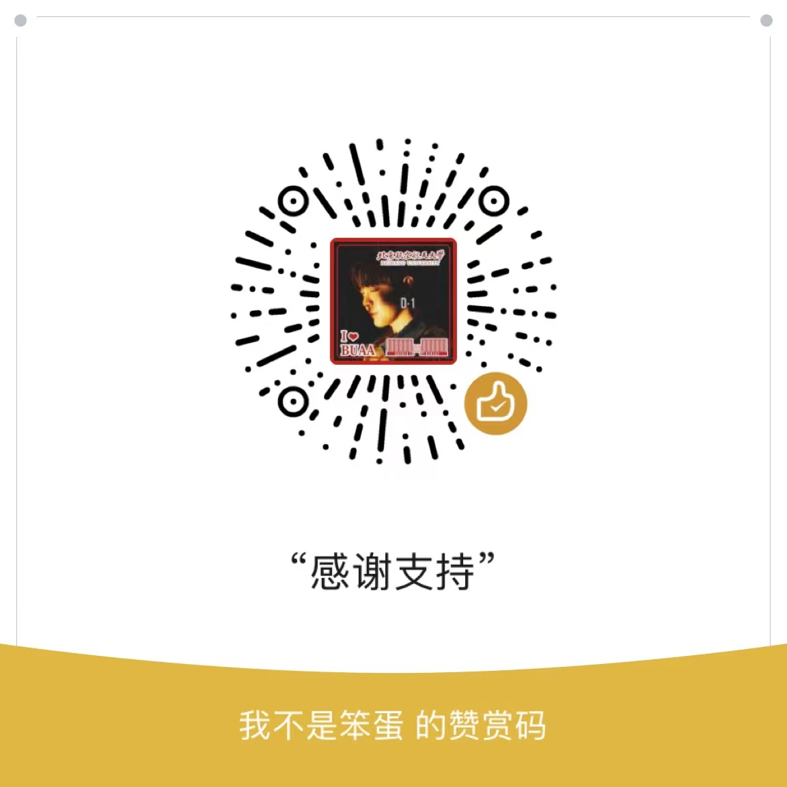

# LibrarySeats
<h2>因为想提供新手使用百度OCR，不慎导致隐私泄露，被山西农业大学某同学恶意刷次数导致欠费，感谢以下同学捐助：</h2>
</img>
</img>
<h4>哔哩哔哩 id：岚风浩 捐助30元 https://space.bilibili.com/376348755</h4>
<h4>哔哩哔哩 id：禅是一枝花2001 捐助30元 https://space.bilibili.com/378833275</h4>
<h4>哔哩哔哩 id：ZXYang7 捐助15元 https://space.bilibili.com/452008473</h4>
<h3>Special seat grab program for the library of Henan University of Economics and Law (to choose seats)</h3>
<h3>河南财经政法大学图书馆抢座方案（选座）</h3>
<h4>If you are from another university, you may need to modify the source code. Don’t worry, how to modify it has already been pointed out in the tutorial: https://space.bilibili.com/85750427</h4>
<h4>如果阁下是其他高校，可能需要修改一下源程序代码，不用担心，怎么修改已经在教程里已经指出：https://space.bilibili.com/85750427</h4>
<h5>If you have money to hold a money market, if you don’t have money to hold a personal one, the source program was written in 2018. The detailed address is: https://github.com/luoenen (the previous account of my own, has been deprecated). During the period, I chose to modify the system. Great, for the improvement of security, it will be repaired from time to time, thanks to the dynamic js decryption provided by Xiangtan University students</h5>
<h5>有钱捧个钱场，没钱捧个人场，本源程序写于2018年，详细地址：https://github.com/luoenen （系本人前账号，已弃用），期间选作系统修改较大，对于提升安全性后会不定期修复，感谢湘潭大学同学提供的动态js解密</h5>
<h6>Welcome to support, please star or fork or donate to support updates</h6>
<h6>欢迎支持，请star或fork或捐助支持更新</h6>

<h3>如何使用：https://space.bilibili.com/85750427</h3>
</img>
</img>
</img>
